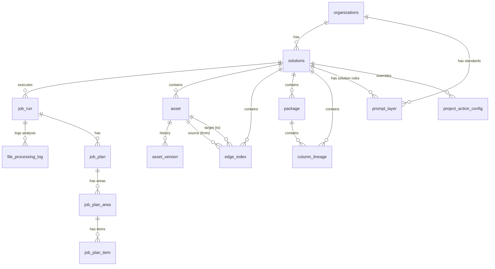

# DiggerAI: Database Schema & Entity Relationships

This document describes the current database schema for the **DiggerAI Platform**, covering both the relational metastore (Supabase/PostgreSQL) and the graph representation (Neo4j).

---

## Entity-Relationship Diagram (ERD)

---

## Core Tables Reference

### 1. SaaS & Projects
- **`organizations`**: Root entity for multi-tenancy.
- **`solutions`**: A project container (e.g., "EDW Migration"). Stores storage paths and status.

### 2. Autonomous Execution Engine
- **`job_run`**: An execution instance for a solution.
- **`job_plan`**: The "Battle Plan" generated by the AI before deep extraction.
- **`job_plan_item`**: Individual file processing strategies (LLM, Parser, Skip).
- **`file_processing_log`**: Detailed audit of AI reasoning, token usage, and costs per file.

### 3. Knowledge Graph Index
- **`asset`**: A node in the discovery graph (Table, Pipeline, Script, etc.). Stores **Business Intent** and **Summaries**.
- **`edge_index`**: Relationships between assets (Lineage, Dependencies).
- **`column_lineage`**: Field-to-field tracing with transformation rules and confidence scores.

### 4. Intelligence Configuration
- **`prompt_layer`**: The 4-tier prompt matrix (Base, Domain, Org, Solution).
- **`project_action_config`**: Granular mapping of prompts to specific agent actions.

---
© 2026 DiggerAI | Advanced Agentic Coding
