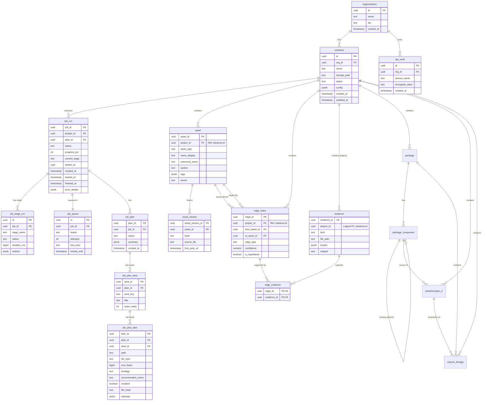

# Database Schema & Entity Relationship Diagram (DER)

Este documento describe el esquema actual de la base de datos de **Nexus Discovery Platform**.

## Diagrama Entidad-Relación (Mermaid)

## Detalles de Tablas

### 1. Core / SaaS

#### `organizations`
Entidad raíz para multitenancy.
- **id**: UUID (PK)
- **name**: Nombre de la organización.
- **tier**: Nivel de suscripción ('FREE', 'PRO', 'ENTERPRISE').

#### `solutions`
Representa un proyecto o "Solución" que se va a analizar.
- **id**: UUID (PK)
- **org_id**: FK a `organizations`. Cascade Delete.
- **name**: Nombre del proyecto.
- **storage_path**: Ruta al archivo ZIP en Supabase Storage.
- **status**: Estado general ('DRAFT', 'QUEUED', 'PROCESSING', 'READY', 'ERROR').
- **config**: JSON con configuración extra (ej. patrones de ignorar).

#### `api_vault`
Almacén seguro para claves de API de terceros.
- **id**: UUID (PK)
- **org_id**: FK a `organizations`.
- **service_name**: Identificador del servicio ('OPENROUTER', etc).
- **encrypted_value**: Valor encriptado de la clave.

---

### 2. Motor de Ejecución & Planeación (Execution & Planning)

#### `job_run`
Registro de una ejecución de análisis para una solución.
- **job_id**: UUID (PK)
- **project_id**: FK a `solutions(id)`.
- **plan_id**: FK al `job_plan` aprobado para esta ejecución.
- **status**: Estado de la ejecución ('queued', 'running', 'completed', 'failed').
- **progress_pct**: Porcentaje de progreso (0-100).
- **error_details**: JSON con detalles de errores si falla.

#### `job_plan`
Contenedor del plan de ejecución generado antes del análisis profundo. Permite el flujo "Human-in-the-loop".
- **plan_id**: UUID (PK).
- **job_id**: FK a `job_run`.
- **status**: Estado del plan ('draft', 'approved').

#### `job_plan_area`
Agrupaciones lógicas dentro del plan (ej. "ETL Files", "SQL Scripts").
- **area_id**: UUID (PK).
- **title**: Título legible del área.

#### `job_plan_item`
Cada archivo individual identificado para ser procesado.
- **item_id**: UUID (PK).
- **path**: Ruta relativa del archivo.
- **strategy**: Estrategia de análisis ('LLM_ONLY', 'PARSER_ONLY', 'SKIP').
- **file_hash**: Hash SHA256 para habilitar el modo **Truly Incremental**.
- **enabled**: Flag que indica si el usuario aprobó el procesamiento de este archivo.

#### `job_stage_run`
Desglose de la ejecución en etapas (ej. "ingest", "extract", "graph").
- **id**: UUID (PK)
- **job_id**: FK a `job_run`.
- **stage_name**: Nombre de la etapa.
- **metrics**: JSON con métricas de la etapa (ej. número de archivos procesados).

#### `job_queue`
Cola simple implementada en SQL para distribuir trabajo a los workers.
- **id**: UUID (PK)
- **job_id**: FK a `job_run`.
- **status**: Estado en cola ('pending', 'processing', 'completed', 'failed').
- **locked_until**: Timestamp para bloqueo optimista.

---

### 3. Catálogo y Grafo (Catalog & Graph)

#### `asset`
Representa cualquier nodo en el grafo de conocimiento (Tabla, Archivo, Columna, Proceso, etc.).
- **asset_id**: UUID (PK).
- **project_id**: FK a `solutions(id)`.
- **asset_type**: Tipo de activo ('TABLE', 'FILE', 'PIPELINE', 'SCRIPT').
- **name_display**: Nombre legible.
- **canonical_name**: Nombre único/técnico.
- **system**: Sistema de origen (ej. 'SQLServer', 'SSIS').
- **tags**: JSONB con metadata enriquecida por la IA:
    - `business_intent`: Propósito funcional del activo.
    - `transformation_logic`: Lógica de procesamiento/filtros (en lenguaje técnico/SQL).
    - `columns`: Listado de columnas con mapeo y lógica individual.

#### `edge_index`
Representa las relaciones (aristas) entre activos.
- **edge_id**: UUID (PK).
- **from_asset_id**: FK a `asset` (Origen).
- **to_asset_id**: FK a `asset` (Destino).
- **edge_type**: Tipo de relación ('INPUT_OF', 'OUTPUT_TO', 'DEPENDS_ON').
- **confidence**: Nivel de confianza (0.0 - 1.0).

#### `evidence`
Evidencia cruda que soporta un hallazgo o relación.
- **evidence_id**: UUID (PK).
- **project_id**: ID de la solución (Relación lógica, sin FK estricta en DB).
- **file_path**: Archivo donde se encontró.
- **snippet**: Fragmento de código relevante.
- **locator**: JSON con ubicación precisa (líneas, xpath).

### 4. Deep Understanding (v4.0)

#### `package`
Cabecera de un paquete ETL o script complejo.
- **package_id**: UUID (PK).
- **project_id**: FK a `solutions(id)`.
- **asset_id**: FK a `asset(asset_id)` (opcional, link al catálogo macro).
- **name**: Nombre del paquete.
- **type**: Tipo ('SSIS', 'DataStage', 'Python').
- **source_system**: Sistema origen conceptual.
- **target_system**: Sistema destino conceptual.
- **business_intent**: Propósito de negocio.

#### `package_component`
Partes internas de un paquete (Tasks, Containers, Steps).
- **component_id**: UUID (PK).
- **package_id**: FK a `package`.
- **parent_component_id**: FK recursiva para jerarquías.
- **name**: Nombre del componente.
- **type**: Tipo técnico ('DataFlow', 'ExecuteSQL', etc).
- **logic_raw**: Fragmento de lógica original.
- **source_mapping**: JSONB con origen de datos.
- **target_mapping**: JSONB con destino de datos.

#### `transformation_ir`
Representación Intermedia de la lógica de transformación.
- **ir_id**: UUID (PK).
- **project_id**: FK a `solutions(id)`.
- **source_component_id**: FK a `package_component`.
- **operation**: Tipo de operación ('READ', 'WRITE', 'JOIN', 'AGGREGATE', etc).
- **logic_summary**: Resumen funcional de la transformación.
- **metadata**: JSONB con detalles técnicos (columnas, expresiones).

#### `column_lineage`
Trazabilidad de bajo nivel (campo a campo).
- **lineage_id**: UUID (PK).
- **project_id**: FK a `solutions(id)`.
- **package_id**: FK a `package`.
- **ir_id**: FK a `transformation_ir`.
- **source_asset_id**: FK a `asset` (Columna origen).
- **source_column**: Nombre de columna origen.
- **target_asset_id**: FK a `asset` (Columna destino).
- **target_column**: Nombre de columna destino.
- **transformation_rule**: Regla aplicada.
- **confidence**: Confianza del enlace.

---

## Notas Técnicas
1.  **Legacy**: Existe una tabla `jobs` (definida en `db.sql`) que ha sido reemplazada funcionalmente por `job_run` (definida en migraciones).
2.  **Foreign Keys**:
    - La mayoría de las relaciones tienen `ON DELETE CASCADE` configurado (reforzado por `migrations/03_nuclear_fix.sql`), lo que significa que borrar una `Solution` limpiará automáticamente sus `Assets`, `Jobs` y `Edges`.
    - `evidence.project_id` no tiene una FK estricta en la definición SQL actual, pero lógicamente pertenece a una solución.
